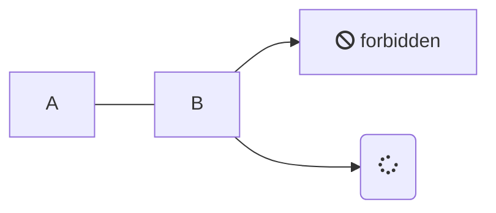
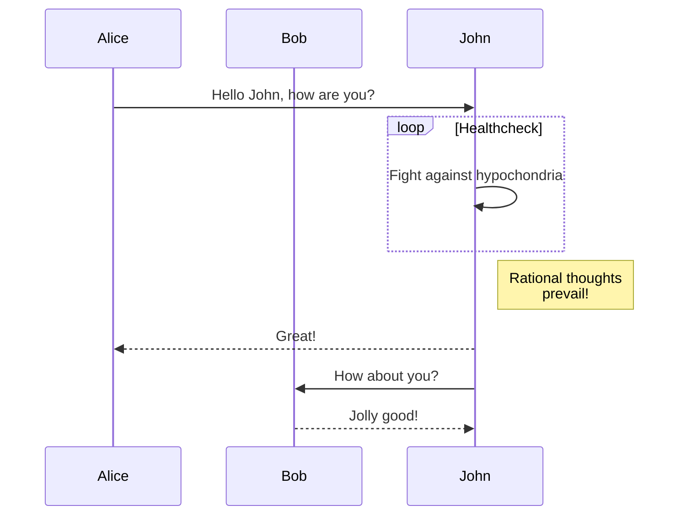

> Current document: `tool4.md`


# Mermaid

The Docsify mermaid plugin (https://github.com/Leward/mermaid-docsify) is installed, and
configured in `index.html`:

<details><summary>Click to see the <code>index.html</code> configuration</summary>

```html
<!-- 

_The mermaid plugin_

Getting the mermaid plugin to work was a lot of trial and error. Ultimately, what
worked was a specific combination calls copy/pasted and modified from these 
sources:
- https://github.com/Leward/mermaid-docsify/blob/master/example/index.html 
- https://codepen.io/leward/project/editor/AyegJW
-->  
<script src=".docsify/static/node_modules/mermaid/dist/mermaid.min.js"></script>
<script type="module">
mermaid.initialize({      
    startOnLoad: true,
    theme: 'dark',             // Included themes are: dark, forest, default, and neutral
    securityLevel: 'loose',
    logLevel: 1
});
window.mermaid = mermaid;
</script>
<script src=".docsify/static/node_modules/docsify/lib/plugins/docsify-mermaid.js"></script>
```

</details>


## Mermaid syntax

### Example 1
Example from: https://github.com/Leward/mermaid-docsify?tab=readme-ov-file#how-to-use


```markdown
    ```mermaid
    graph LR
        A --- B
        B-->C[fa:fa-ban forbidden]
        B-->D(fa:fa-spinner);
    ```
```



### Example 2
Example from: https://codepen.io/leward/project/editor/AyegJW


This syntax renders like this:
```markdown
    ```mermaid
    sequenceDiagram
        participant Alice
        participant Bob
        Alice->>John: Hello John, how are you?
        loop Healthcheck
            John->>John: Fight against hypochondria
        end
        Note right of John: Rational thoughts <br/>prevail!
        John-->>Alice: Great!
        John->>Bob: How about you?
        Bob-->>John: Jolly good!
    ```
```


